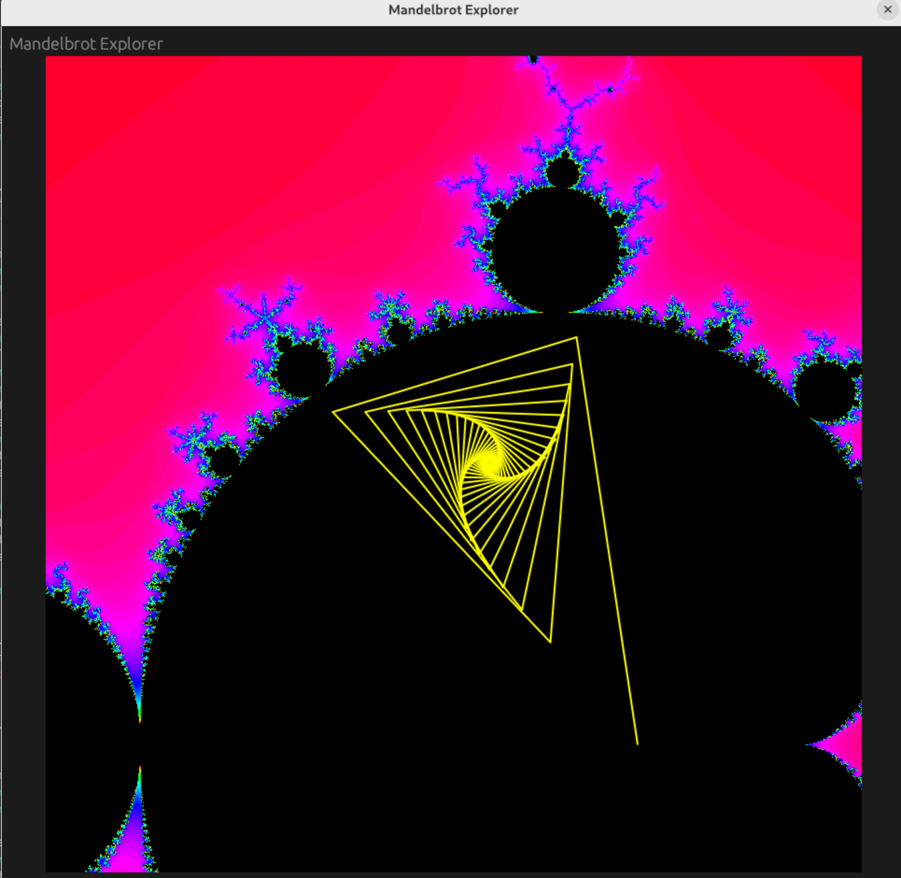

# Mandelbrot Explorer

Mandelbrot Explorer is a desktop application for interactively exploring the Mandelbrot set, written in Rust using the [`eframe`](https://crates.io/crates/eframe) and [`egui`](https://crates.io/crates/egui) GUI libraries.

## Features
- **Interactive Mandelbrot Set Viewer**: Zoom and pan around the Mandelbrot set using your mouse.
- **Real-Time Rendering**: The fractal is rendered in real time as you zoom in and out.
- **Path Visualization**: Click or drag on the fractal to visualize the escape path (yellow line) for a given point.

## Screenshots


## Getting Started

### Prerequisites
- [Rust](https://www.rust-lang.org/tools/install) (edition 2024 or later)

### Build and Run

```bash
cd mandelbrot-explorer
cargo run
```

This will build and launch the Mandelbrot Explorer GUI.

## Project Structure
- `src/main.rs`: Main application code and Mandelbrot rendering logic.
- `Cargo.toml`: Project manifest and dependencies.

## Dependencies
- [`eframe`](https://crates.io/crates/eframe) (GUI framework)
- [`egui`](https://crates.io/crates/egui) (immediate mode GUI library)

## License

This project is licensed under the MIT License. See the [LICENSE](LICENSE) file for details. 